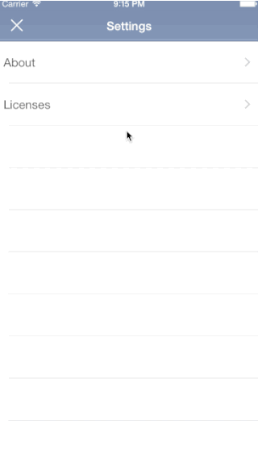

# DDLicenseViewController




[](https://travis-ci.org/dougdiego/DDLicenseViewController)
[](http://cocoadocs.org/docsets/DDLicenseViewController)
[](http://cocoadocs.org/docsets/DDLicenseViewController)
[](http://cocoadocs.org/docsets/DDLicenseViewController)

## Usage

To run the example project, clone the repo, and run `pod install` from the Example directory first.

## Requirements
* iOS 7.0 or later
* [CocoaPods](http://cocoapods.org)

## Installation

DDLicenseViewController is available through [CocoaPods](http://cocoapods.org). To install
it, simply add the following line to your Podfile:

    pod "DDLicenseViewController"
	
## Usage
Objective-C
```objective-c

    // Load Licenses1 from a plist
    NSString *path = [[NSBundle mainBundle] pathForResource: @"Licenses1" ofType:@"plist"];
    NSArray * licenses = [[NSArray alloc] initWithContentsOfFile:path];
    NSArray * ddLicenses = [DDLicense licenseArrayFromDictionaryArray: licenses];
    
    DDLicensesViewController * vc = [[DDLicensesViewController alloc] init];
    vc.title = @"Licenses";
    vc.licenses = ddLicenses;
    
    // Optional: license list font
    vc.licenseListFont = [UIFont fontWithName:@"HelveticaNeue-Light" size:17];
    
     // Optional: license font
    vc.licenseFont = [UIFont fontWithName:@"Courier" size:17];
    
    // Add close button to navigation bar
    vc.navigationItem.leftBarButtonItem = [[UIBarButtonItem alloc] initWithBarButtonSystemItem:UIBarButtonSystemItemStop
                                                                                        target:self
                                                                                        action:@selector(closeButtonAction:)];
    
    // Put DDLicensesViewController in a UINavigationController and show
    UINavigationController * nvc = [[UINavigationController alloc] initWithRootViewController:vc];
    [self presentViewController:nvc animated:YES completion:nil];	
	
```
Swift
```swift
         // Load Licenses1 from a plist
        let path: NSString = NSBundle.mainBundle().pathForResource("Licenses", ofType: "plist")!;
        let licenses = NSArray(contentsOfFile: path);
        let ddLicenses: NSArray = DDLicense.licenseArrayFromDictionaryArray(licenses);
        
        var vc: DDLicensesViewController = DDLicensesViewController()
        vc.title = "Licenses";
        vc.licenses = ddLicenses;
        
        // Optional: license list font
        vc.licenseListFont = UIFont(name: "HelveticaNeue-Light", size: 17);
        
        // Optional: license font
        vc.licenseFont = UIFont(name: "Courier", size: 17);
        
        self.navigationController?.pushViewController(vc, animated: true);
```
## Author

Doug Diego

## License

DDLicenseViewController is available under the MIT license. See the LICENSE file for more info.

